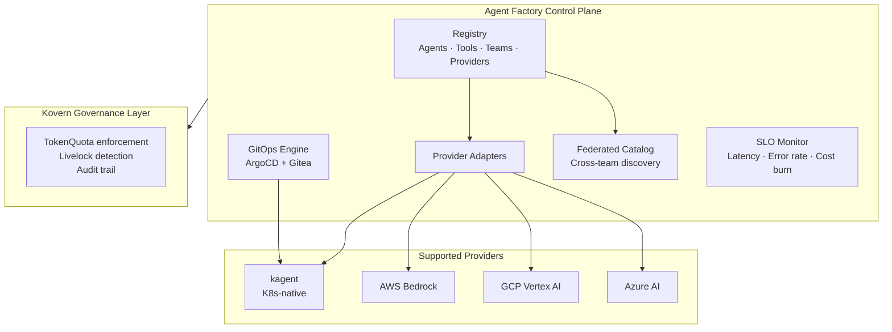

# Agent Factory

> **Agent Factory is the platform layer your AI agents are missing.** Think of it as the Kubernetes control plane — but for AI agents across every cloud provider your teams use.

---

## What It Solves

When teams independently deploy agents to Bedrock, Vertex, Azure, or in-cluster via kagent, you get invisible sprawl:

- No central registry of what exists
- No visibility into what tools each agent can access
- No lifecycle management (owner, creation date, last review)
- Rebuilding the same agent in three different teams

Agent Factory ends this.

---

## Architecture

---

## Core Concepts

| Concept | Description |
|---|---|
| **Agent** | A registered AI agent with name, provider, tools, team owner, and lifecycle state |
| **Provider** | The runtime where the agent executes — kagent (K8s), AWS Bedrock, GCP Vertex, Azure AI |
| **Tool** | A capability the agent can invoke — API calls, DB queries, file access |
| **Team** | The owning team responsible for budget, access, and quarterly review |
| **TokenQuota** | A Kovern resource that enforces spend limits on the agent's Kubernetes ServiceAccount |

---

## OSS vs Enterprise

| Feature | OSS | Enterprise |
|---|---|---|
| Register agents, teams, tools | ✅ | ✅ |
| kagent provider (K8s in-cluster) | ✅ | ✅ |
| AWS Bedrock provider | — | ✅ |
| GCP Vertex AI provider | — | ✅ |
| Azure AI provider | — | ✅ |
| Discover + import existing cloud agents | — | ✅ |
| Blast radius analysis | — | ✅ |
| Agent SLOs + burn rate alerting | — | ✅ |
| Model upgrade automation | — | ✅ |
| Tool access recertification (SOC2) | — | ✅ |
| Federated agent catalog (cross-team) | — | ✅ |
| Multi-agent pipeline DAGs | — | ✅ |
| Audit logs + compliance reports | — | ✅ |

---

## Enterprise Use Cases

- [Multi-Team Agent Deployment](use-case-multi-team.md) — 5+ teams, no chaos, no overlap
- [Multi-Cloud Governance](use-case-multi-cloud.md) — Bedrock + Vertex + Azure from one control plane
- [Federated Agent Catalog](use-case-federated-catalog.md) — reuse agents across teams
