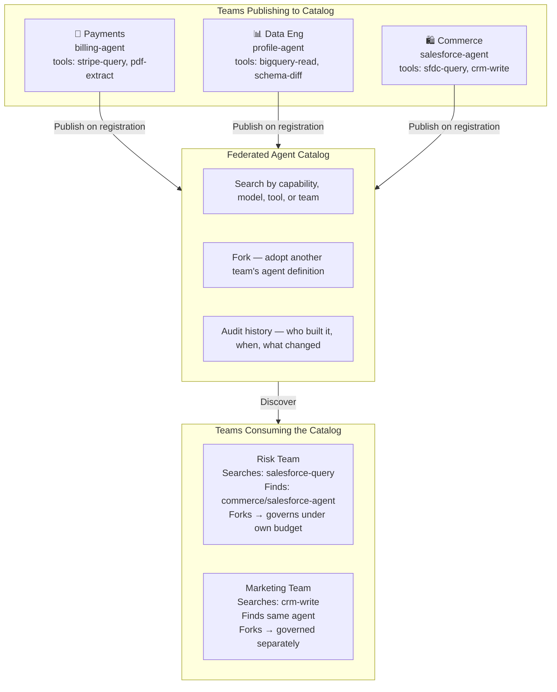
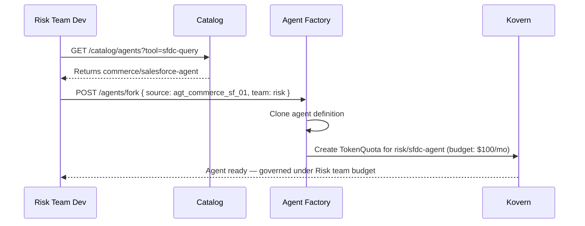

# Use Case: Federated Agent Catalog

**Persona:** Engineering Manager / Senior Developer  
**Problem:** Three teams have independently built Salesforce query agents. Nobody knew the others existed.

---

## The Situation

When agents are deployed in isolation — per-team, per-cloud, with no shared registry — parallel development is inevitable. A team builds an agent that queries Salesforce. Two months later, a different team builds the same thing from scratch. Then a third.

In a company with 10+ product teams each shipping agents, this is the default outcome without a catalog.

---

## How Agent Factory Solves It

The Federated Agent Catalog is a queryable index of every registered agent across all teams and providers. Teams can search by capability, model, tool, or team name — and fork proven agents rather than building from scratch.



---

## Catalog Query Example

```bash
# Find all agents that have a Salesforce tool
GET /catalog/agents?tool=sfdc-query

# Response
[
  {
    "id": "agt_commerce_sf_01",
    "name": "salesforce-agent",
    "team": "commerce",
    "provider": "kagent",
    "model": "claude-sonnet-4-5",
    "tools": ["sfdc-query", "sfdc-write", "crm-read"],
    "runs_last_30d": 1420,
    "avg_cost_per_run": "$0.012",
    "status": "stable"
  }
]
```

---

## Fork and Govern

When a team forks an agent from the catalog, Agent Factory:

1. Copies the agent definition into the new team's namespace
2. Creates a new `TokenQuota` scoped to the new team's ServiceAccount
3. Maintains a lineage link to the original — so model deprecations and security patches propagate



---

## Key Outcome

> Stop rebuilding what another team already tested in production. The Federated Catalog is effectively an internal npm registry — but for AI agents.

| Metric | Without Catalog | With Catalog |
|---|---|---|
| Time to deploy proven agent | 3–6 weeks (build from scratch) | 1–2 hours (fork + configure) |
| Duplicate agents | Unknown — no visibility | Zero — detected at registration |
| Security review surface | Per-team, ad-hoc | Inherited from source agent |
