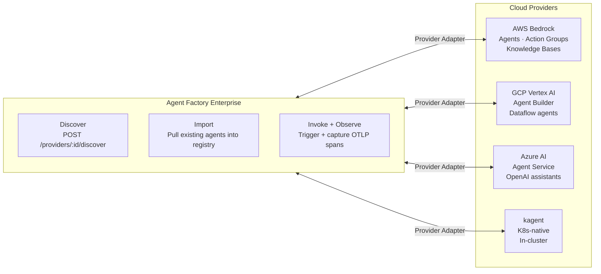
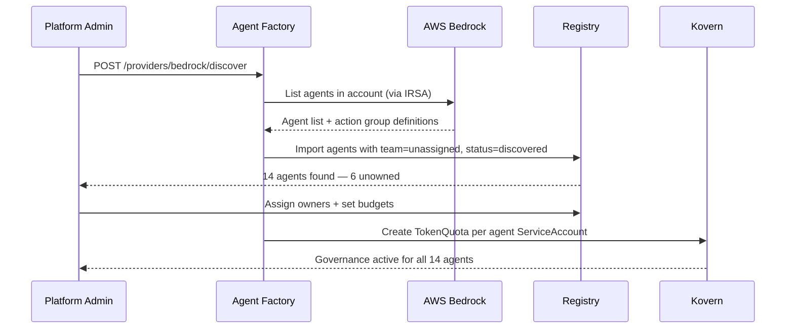

# Use Case: Multi-Cloud Agent Governance

**Persona:** Enterprise Architect  
**Problem:** Agents are running on Bedrock, Vertex, and Azure — you can't manage them from one place and you can't import existing agents into your governance framework.

---

## The Situation

Large enterprises don't pick one cloud. They run AWS for financial workloads, GCP for ML/data, and Azure for Microsoft-adjacent products. Each AI platform team ends up with different agents in different clouds with no common governance layer.

The specific pain points:

1. **No unified inventory** — you need to log into three cloud consoles to see what's running
2. **Can't import existing agents** — the team that deployed that Bedrock agent six months ago is gone; you have no record of what tools it has access to
3. **No cross-cloud spend view** — your AI bill is spread across three invoices

---

## How Agent Factory Solves It

### Provider Adapters

Agent Factory connects to each cloud provider via a dedicated adapter. For each provider you configure, it can:

- **Discover** — scan your cloud account and list existing agents
- **Import** — pull an existing agent into the registry with its tool definitions
- **Invoke** — trigger runs and capture telemetry back into Kovern

---

## Discovery Flow

When you connect a new cloud provider and run discovery:

---

## Unified Control Plane View

After discovery and import, every agent across every cloud is visible in a single registry view:

| Agent | Provider | Team | Monthly Budget | Spend | Status |
|---|---|---|---|---|---|
| `billing-reconciler` | AWS Bedrock | Payments | $200 | $142 | 🟢 Active |
| `dataset-profiler` | GCP Vertex | Data Eng | $100 | $88 | 🟡 SoftLimit |
| `risk-scorer` | Azure AI | Risk | $500 | $12 | 🟢 Active |
| `deploy-agent` | kagent | Platform | $50 | $6 | 🟢 Active |

---

## Key Outcome

> One registry. One governance layer. Every agent, regardless of where it runs.

This is the feature that matters most to large enterprise security and platform teams — they already have agents on Bedrock. They don't want to rebuild on kagent. They want *governance* over what they already have.
