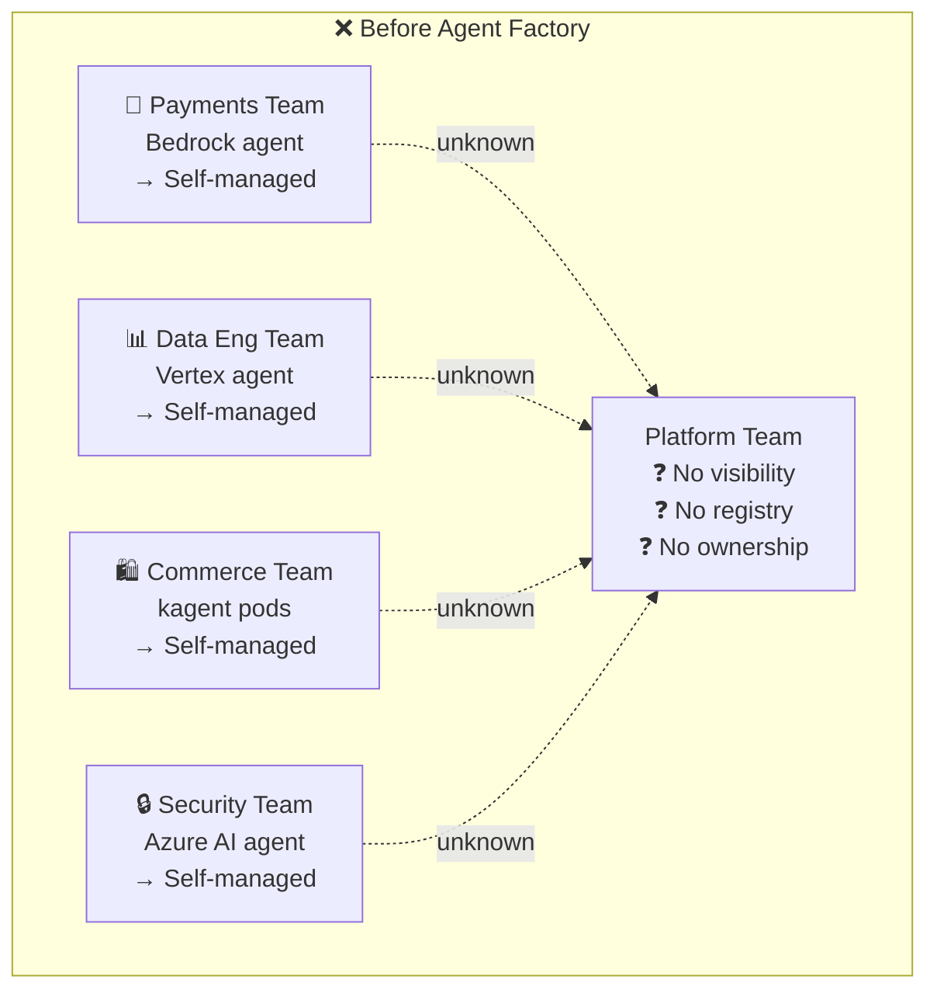
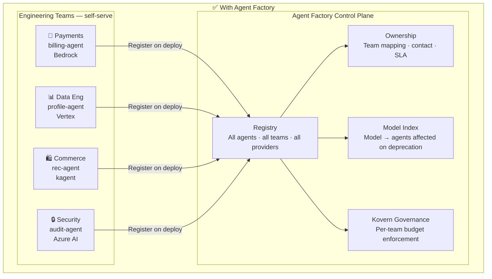
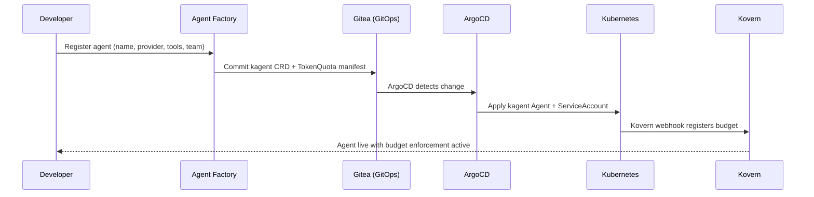

# Use Case: Multi-Team Agent Deployment

**Persona:** Platform Engineering Lead  
**Problem:** 5+ engineering teams each deploying AI agents independently — no registry, no ownership, no visibility.

---

## The Situation

Your organisation has scaled beyond the point where one team can know what another team is building. The payments team ships agents for invoice reconciliation. Data Eng ships agents for dataset profiling. Product squads ship conversational agents for different verticals.

Three months in, nobody can answer:

- How many agents are running in production?
- Which team owns the Bedrock agent that spent $4,200 last month?
- If a model is deprecated, which agents are affected?

---

## How Agent Factory Solves It

Agent Factory provides a **single source of truth** for every agent across every team — without centralising control or slowing teams down.

---

## What Each Stakeholder Gets

| Stakeholder | What they see |
|---|---|
| **Platform Team** | Full registry — every agent, owner, provider, model, status |
| **Engineering Team** | Their own agents + ability to discover other teams' catalog |
| **FinOps** | Per-team spend breakdown, burn rate trends, budget alerts |
| **Security** | Tool access matrix — what each agent can actually call |
| **On-call SRE** | Ownership contact for any agent running in production |

---

## Deployment Flow

When a team deploys a new agent through Agent Factory, the following happens automatically:

---

## Key Outcome

> One platform team of 3 can now safely support 150+ engineers deploying AI agents — because the registry, ownership, and budget guardrails are all automated.
