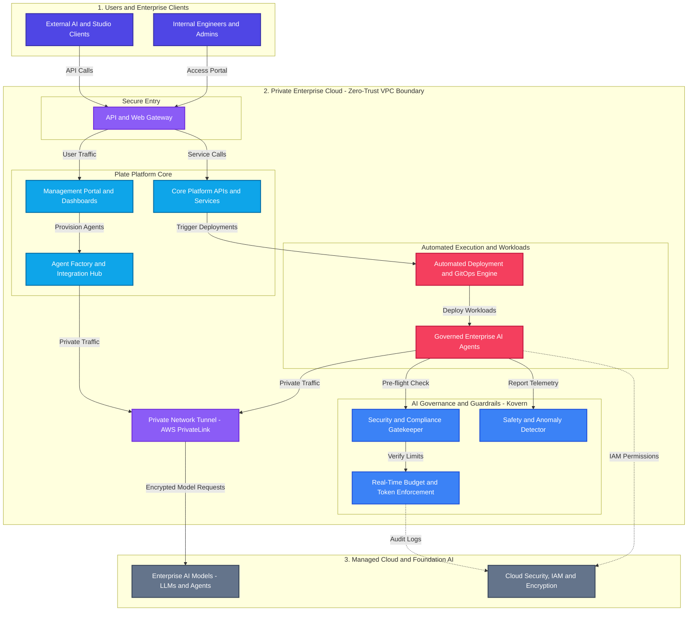

This high-level architecture diagram illustrates the end-to-end capabilities, governance boundaries, and integration flows of the **Plate Platform**. Designed for enterprise architects, engineering leadership, and managers, it highlights business capabilities and security boundaries using clear, generic terms.

---

## 📐 High-Level Mermaid Architecture Diagram

---

## 🔑 Key Architectural Takeaways for Leadership

1. **Zero-Trust Security Boundary (BYOC - Bring Your Own Cloud)**
   - All AI workloads and APIs run strictly within your enterprise private cloud network (VPC).
   - No sensitive data or AI requests ever traverse the public internet when communicating with cloud AI services (connected via private network tunnels).

2. **Plate Platform Core (Control Plane)**
   - Provides a unified web portal for management dashboards, system APIs, and an **Agent Factory** hub to easily create and manage enterprise AI agents.

3. **Real-Time AI Governance & Cost Control (Kovern)**
   - Prevents AI cost runaways by enforcing token and dollar spending limits *before* AI agents execute.
   - Includes automated anomaly detection to catch runaway loops and prevent security/operational risks.

4. **Automated Enterprise Execution (GitOps & AI Agents)**
   - Leverages automated continuous deployment (GitOps) to version, audit, and safely release AI agents into production environments.
