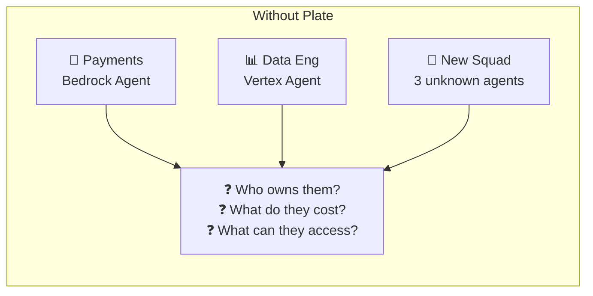
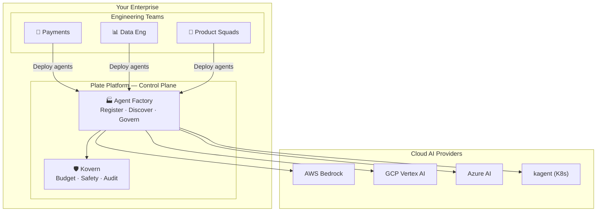

# Why Plate for Enterprise?

> **AI agent sprawl is the 2026 microservices problem.** Plate Platform is the control plane that solves it — before it peaks.

---

## The Problem

Your teams are shipping AI agents fast. Payments has one on AWS Bedrock. Data Eng runs one on GCP Vertex. A new squad spun up three more last week — nobody knows what they cost or what data they can touch.

This is the pattern that created the need for Backstage in 2019 — but for microservices. **Agent Factory can be here before the AI agent explosion peaks.**

---

## The Plate Answer

Two focused capabilities that form a complete enterprise control plane:

| Capability | What it does |
|---|---|
| **Agent Factory** | Single registry + lifecycle management for every agent across every team and cloud provider |
| **Kovern** | Kubernetes-native admission enforcement — hard spend caps, loop detection, immutable audit trail |

---

## Who Is This For?

| Role | What Plate gives you |
|---|---|
| **Platform Engineering Lead** | One control plane for all agents — no more shadow deployments |
| **CTO / FinOps** | Hard spend caps enforced *before* an agent pod starts — no surprise $10k+ bills |
| **Security / Compliance** | Immutable audit log of every agent action for SOC2, ISO27001, FedRAMP |
| **SRE / Platform Ops** | Auto-detect and evict agents stuck in infinite loops before they burn budget |
| **Engineering Manager** | Cross-team agent catalog — find what another team built before rebuilding it |

---

## Scope of These Docs

This documentation covers **Agent Factory** and **Kovern** only. These are the two enterprise capabilities that differentiate Plate. The rest of the platform (Workloads, Origin, Flows) is covered in the main OSS docs.
