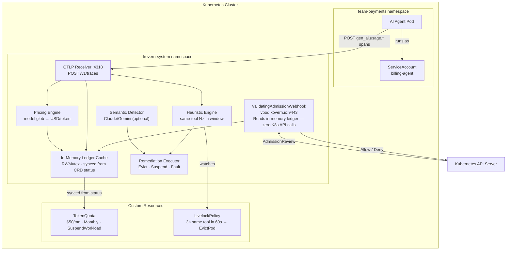

import useBaseUrl from '@docusaurus/useBaseUrl';


# Kovern AI Governance

> **Kovern adds two controls to the Kubernetes API that standard Kubernetes has no concept of: financial spend limits on agent pods, and behavioral loop detection from OpenTelemetry spans.**

---

## What It Solves

AI agents introduce operational risks that traditional Kubernetes tooling was not designed for:

| Risk | Without Kovern | With Kovern |
|---|---|---|
| AI API cost overrun | Agent runs until account limit | Hard cap enforced before pod starts |
| Infinite agent loop | Runs forever, burns budget | Detected from OTLP spans, pod evicted |
| Compliance gap | No tamper-proof audit trail | Every span, every action recorded |
| Budget visibility | Unknown until cloud bill arrives | Real-time USD spend in `kubectl get tq` |

---

## How It Works



---

## The Two CRDs

### `TokenQuota` — Budget Enforcement

Enforces a financial spending cap scoped to a Kubernetes `ServiceAccount`. Cost is calculated in real-time from OTLP `gen_ai.usage.*` spans via a model price table.

```yaml
apiVersion: kovern.io/v1alpha1
kind: TokenQuota
metadata:
  name: billing-agent-quota
  namespace: team-payments
spec:
  targetRef:
    kind: ServiceAccount
    name: billing-agent
  billingScope:
    maxFinancialBudget: "50"    # hard $50 USD cap
    renewalInterval: Monthly
    softLimitPct: 80            # emit K8s Warning Event at $40
  enforcementAction: SuspendWorkload
```

**States:** `Active` → `SoftLimit` → `Exceeded` → `Suspended`

### `LivelockPolicy` — Loop Detection

Watches OTLP spans to detect agents calling the same tool repeatedly within a time window.

```yaml
apiVersion: kovern.io/v1alpha1
kind: LivelockPolicy
metadata:
  name: payments-loop-guard
  namespace: team-payments
spec:
  selector:
    matchLabels:
      app.kubernetes.io/component: agent
  detection:
    otel:
      maxSameToolCalls: 3
      windowSeconds: 60
  remediation:
    action: EvictPod
    emitEvent: true
```

---

## Key Design Invariants

- **The admission webhook never calls the Kubernetes API on the hot path** — it reads only from the in-memory ledger.
- **Missing `TokenQuota` = fail-open** — namespaces without a quota are unaffected.
- **Operators opt in explicitly** — nothing is enforced by default.

---

## Enterprise Use Cases

- [AI Cost Runaway Prevention](use-case-cost-control.md)
- [Stuck Agent Loop Detection](use-case-livelock.md)
- [Compliance & Audit Trail](use-case-compliance.md)
