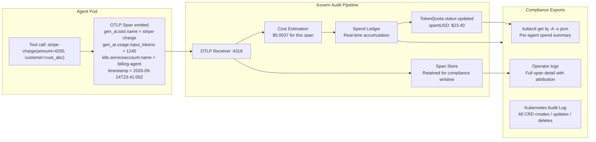
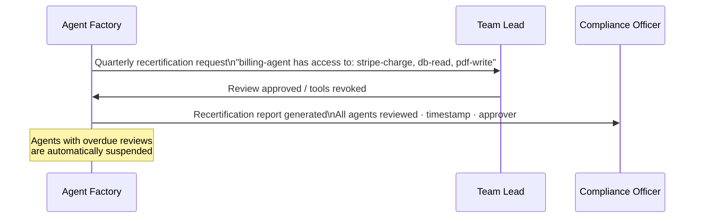

# Use Case: Compliance & Audit Trail

**Persona:** Security Lead / Compliance Officer / CISO  
**Problem:** Your SOC2 auditor asks: "Show me every action your AI agents took in the last 90 days and who authorised each configuration change." You have no answer.

---

## The Situation

AI agents are now processing regulated data — financial transactions, healthcare records, PII. Compliance frameworks that govern human-operated systems now apply to AI-operated ones:

| Framework | AI-relevant requirement |
|---|---|
| **SOC2 Type II** | Logical access controls, change management, monitoring, incident response |
| **ISO27001** | Asset inventory, access control review, audit logging |
| **FedRAMP** | Continuous monitoring, incident detection, configuration management |

Most organisations running AI agents cannot satisfy these requirements because: agents operate autonomously, their tool calls are not logged to a tamper-proof store, and configuration changes have no approval trail.

---

## What Kovern Records

Every OTLP span that an agent emits to Kovern's receiver becomes a permanent record:



---

## Configuration Change Audit

Every change to a `TokenQuota` or `LivelockPolicy` is recorded in the Kubernetes audit log — including who made the change, via which ServiceAccount, and when.

```bash
# Kubernetes audit log entry for a TokenQuota budget increase
{
  "kind": "Event",
  "apiVersion": "audit.k8s.io/v1",
  "verb": "patch",
  "user": { "username": "platform-admin@company.com" },
  "objectRef": {
    "resource": "tokenquotas",
    "name": "billing-agent-quota",
    "namespace": "team-payments"
  },
  "requestReceivedTimestamp": "2026-09-24T14:22:11Z",
  "responseStatus": { "code": 200 }
}
```

---

## Tool Access Recertification (Enterprise)

On a configurable schedule (quarterly is standard for SOC2), Agent Factory generates a recertification report: every agent, every tool it has access to, and the team responsible. Team leads receive a review request. Agents whose reviews are overdue are automatically deactivated.



---

## What the Auditor Sees

After 90 days of Kovern-instrumented operation, you can produce:

| Evidence | Source | Covers |
|---|---|---|
| Agent inventory | `kubectl get tq -A` | Every governed agent, team, budget |
| Per-agent spend history | `TokenQuota.status` + operator logs | Financial controls (SOC2 CC6.1) |
| Tool access matrix | Agent Factory registry | Access control review (ISO 9.4) |
| Config change log | Kubernetes audit log | Change management (SOC2 CC8.1) |
| Loop detection events | `kubectl get llp -A` | Incident detection (SOC2 CC7.2) |
| Recertification reports | Agent Factory Enterprise | Periodic access review (SOC2 CC6.3) |

---

## Key Outcome

> Before Kovern: "We have agents running. We can't tell you what they did."  
> After Kovern: Complete, timestamped, attribution-linked record of every AI agent action — exportable for any auditor.
