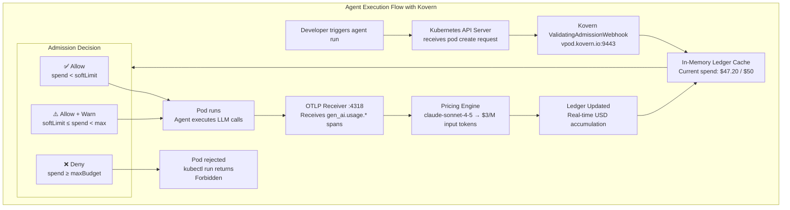

# Use Case: AI Cost Runaway Prevention

**Persona:** CTO / FinOps / Platform Engineering Lead  
**Problem:** An AI agent runs unattended overnight, makes thousands of LLM calls, and generates a $9,400 cloud bill by morning.

---

## The Situation

AI API costs are fundamentally different from compute costs:

- A single misbehaving agent run can exceed your **monthly budget in hours**
- There is no native Kubernetes mechanism to cap financial spend — only CPU and memory
- By the time your cloud bill arrives, the damage is done

Standard approaches — cloud billing alerts, per-team budgets — are **trailing indicators**. They tell you what happened. Kovern is a **leading control** — it prevents the spend from occurring.

---

## How Kovern Prevents It

Kovern's `TokenQuota` enforces a financial budget scoped to a Kubernetes `ServiceAccount`. The enforcement happens at the **Kubernetes admission layer** — before the pod is scheduled, before any LLM call is made.



---

## Setup in Three Steps

**Step 1 — Create a TokenQuota for the agent's ServiceAccount:**

```yaml
apiVersion: kovern.io/v1alpha1
kind: TokenQuota
metadata:
  name: billing-agent-quota
  namespace: team-payments
spec:
  targetRef:
    kind: ServiceAccount
    name: billing-agent
  billingScope:
    maxFinancialBudget: "50"     # hard $50/month cap
    renewalInterval: Monthly
    softLimitPct: 80             # K8s Warning Event at $40
  enforcementAction: SuspendWorkload
```

**Step 2 — Configure the agent to send OTLP spans to Kovern:**

```python
# In your agent's OpenTelemetry setup
from opentelemetry.sdk.resources import Resource

resource = Resource.create({
    "k8s.namespace.name": "team-payments",
    "k8s.serviceaccount.name": "billing-agent",  # links span to TokenQuota
})

# Export to Kovern receiver
exporter = OTLPSpanExporter(endpoint="http://kovern.kovern-system:4318/v1/traces")
```

**Step 3 — Monitor in real-time:**

```bash
kubectl get tokenquotas -n team-payments

# NAME                   STATE      SPENT     BUDGET   RENEWAL   AGE
# billing-agent-quota    SoftLimit  $41.20    $50      Monthly   12d
```

---

## What Happens When Budget Is Exceeded

When `spentUSD ≥ maxFinancialBudget`:

1. The admission webhook returns `Forbidden` for any new pod create with that ServiceAccount
2. The `TokenQuota` state transitions to `Exceeded`
3. A Kubernetes Warning Event is emitted
4. The agent cannot run again until the renewal period resets (or a platform admin manually resets the quota)

---

## Key Outcome

> A $50/month budget cap means the maximum you can ever be surprised by that agent is $50. Not $9,400.

| Scenario | Without Kovern | With Kovern |
|---|---|---|
| Agent loops overnight | Uncapped LLM calls → large bill | Pod denied after budget exceeded |
| Wrong model used | Expensive model runs unchecked | High-cost span detected, limit enforced |
| Budget visibility | End-of-month cloud invoice | Real-time via `kubectl get tq` |
| Engineering response time | 24–72 hours after alert | Immediate — Kubernetes Event emitted |
