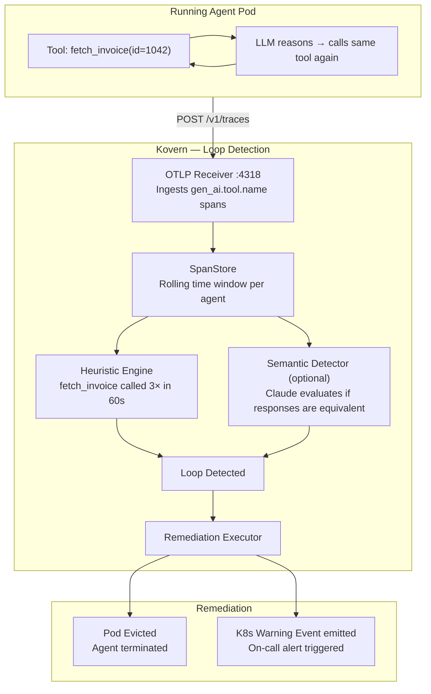

# Use Case: Stuck Agent Loop Detection

**Persona:** SRE / Platform Operations  
**Problem:** An AI agent gets stuck calling the same tool in a loop. Nobody notices until the next morning — by which time the budget is gone and the pod is still running.

---

## The Situation

AI agents operate autonomously. When an agent encounters an ambiguous situation — a tool that keeps returning the same result, a prompt that generates the same plan repeatedly — it can enter a loop:

```
Tool call: fetch_invoice(id=1042)
→ Result: { status: "pending" }
→ LLM: I should try again to check if it's been updated
Tool call: fetch_invoice(id=1042)
→ Result: { status: "pending" }
→ LLM: I should try again...
(repeats 400 times over 6 hours)
```

This is not a code bug. It's an emergent behavior from how the LLM reasons about uncertain states. No amount of unit tests catches it in advance.

---

## How Kovern Detects It

Kovern's `LivelockPolicy` watches the OTLP spans the agent exports on every tool call. The **heuristic engine** detects when the same `gen_ai.tool.name` is called more than `N` times within a rolling time window.



---

## LivelockPolicy Configuration

```yaml
apiVersion: kovern.io/v1alpha1
kind: LivelockPolicy
metadata:
  name: payments-loop-guard
  namespace: team-payments
spec:
  selector:
    matchLabels:
      app.kubernetes.io/component: agent  # target all agent pods in namespace
  detection:
    otel:
      maxSameToolCalls: 3       # same tool called 3+ times...
      windowSeconds: 60         # ...within a 60-second window
      identicalResponseHash: true  # only if responses are identical
    # Optional: enable semantic detection (requires ANTHROPIC_API_KEY)
    # semantic:
    #   enabled: true
    #   windowTurns: 5
    #   similarityThreshold: "0.92"
    #   model: claude-haiku-4-5-20251001
  remediation:
    action: EvictPod
    emitEvent: true
```

---

## Detection Modes

### Heuristic Detection (default — no external calls)

Counts identical tool calls in a rolling window. Fast, cheap, no dependencies. Catches mechanical loops.

### Semantic Detection (optional — requires Anthropic API key)

Uses Claude to evaluate whether the last N turns of the agent's message history are *semantically equivalent* — even if the strings differ slightly. Catches more subtle loops where the LLM rephrases but repeats the same plan.

```bash
# Enable semantic detection
kubectl create secret generic anthropic-key \
  --from-literal=api-key=sk-ant-... \
  -n kovern-system

helm upgrade kovern ./charts/kovern \
  --set anthropic.apiKeySecret.name=anthropic-key
```

---

## Observing Detections

```bash
kubectl get livelockpolicies -A

# NAME                  DETECTIONS  LAST DETECTION  SEMANTIC  AGE
# payments-loop-guard   7           3m ago          false     14d
```

---

## Key Outcome

> An agent that would have looped for 8 hours burning $200 in API calls is instead evicted within 60 seconds of the loop starting — with a Kubernetes Warning Event firing your on-call alert.

| Metric | Without Kovern | With Kovern |
|---|---|---|
| Loop detection time | Hours (if noticed at all) | 60 seconds |
| Wasted spend per incident | $50–$500 | < $2 (3 tool calls) |
| On-call signal | Cloud billing alert (hours later) | Kubernetes Warning Event (immediate) |
| Recovery | Manual pod kill | Automatic eviction |
